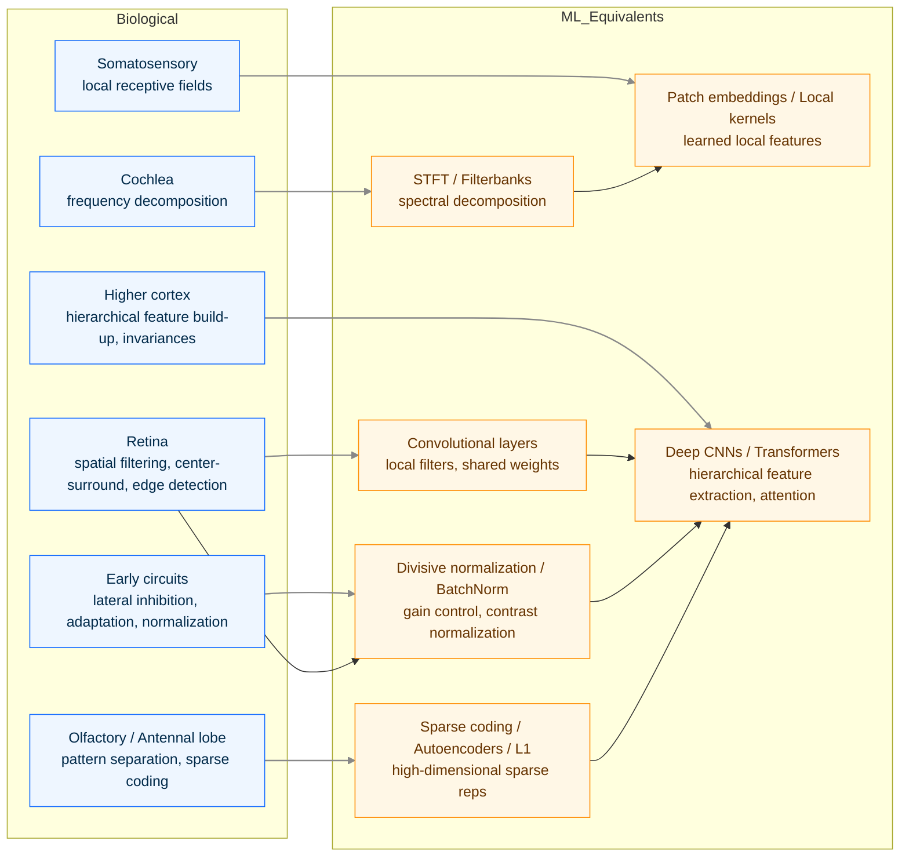

```mermaid
graph LR
  %% Biological column
  subgraph Biological
    R[Retina\nspatial filtering, center-surround, edge detection]
    C[Cochlea\nfrequency decomposition]
    S[Somatosensory\nlocal receptive fields]
    E[Early circuits\nlateral inhibition, adaptation, normalization]
    H[Higher cortex\nhierarchical feature build-up, invariances]
    O[Olfactory / Antennal lobe\npattern separation, sparse coding]
  end

  %% ML equivalents column
  subgraph ML_Equivalents
    conv[Convolutional layers\nlocal filters, shared weights]
    stft[STFT / Filterbanks\nspectral decomposition]
    patch[Patch embeddings / Local kernels\nlearned local features]
    norm[Divisive normalization / BatchNorm\ngain control, contrast normalization]
    deep[Deep CNNs / Transformers\nhierarchical feature extraction, attention]
    sparse[Sparse coding / Autoencoders / L1\nhigh-dimensional sparse reps]
  end

  %% Mappings
  R --> conv
  C --> stft
  S --> patch
  E --> norm
  H --> deep
  O --> sparse

  %% Cross-links (additional analogies)
  R --> norm
  conv --> deep
  stft --> patch
  norm --> deep
  sparse --> deep

  classDef bio fill:#eef6ff,stroke:#0b66ff,color:#012a4a;
  classDef ml fill:#fff7e6,stroke:#ff8c00,color:#663300;
  class R,C,S,E,H,O bio;
  class conv,stft,patch,norm,deep,sparse ml;

  %% compact notes
  linkStyle 0 stroke:#888,stroke-width:1.5px
  linkStyle 1 stroke:#888,stroke-width:1.5px
  linkStyle 2 stroke:#888,stroke-width:1.5px
  linkStyle 3 stroke:#888,stroke-width:1.5px
  linkStyle 4 stroke:#888,stroke-width:1.5px
  linkStyle 5 stroke:#888,stroke-width:1.5px
```
