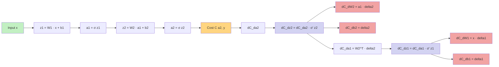

[[Delta error]]

Reference:
- https://www.3blue1brown.com/lessons/backpropagation-calculus#title

Information flows **output → hidden → input** during the backward pass.
## **🏎️ Why is Backpropagation “Fast”?**

Prior to backpropagation, one could compute gradients via **finite differences**, i.e., slightly change each weight, rerun the network, and see how the output changes. But that’s **computationally expensive**:

- For n weights, you’d need to run the entire network **n times** just to estimate the gradient.

Backpropagation **avoids that** by using the **chain rule of calculus** to **reuse intermediate computations** — essentially doing a **single backward pass** that gives **all gradients simultaneously**.

### How use of chain rule used for intermediate computation?
### **🎯 Goal of Backpropagation:**

Compute the gradient of cost function $C$ w.r.t. every weight and bias:
$$ \frac{\partial C}{\partial w^l_{jk}} $$
    
$$ \frac{\partial C}{\partial b^l_j} $$
To do this, we need to know:

> How changing **any internal variable** (like a weight) affects the **final output cost** — through a chain of activations and layers.

---
## **🔗 Enter the Chain Rule**

### **🔍 Chain Rule in Calculus:**
If:

$$

C = f(g(h(x)))

$$

Then:
$$

\frac{dC}{dx} = f’(g(h(x))) \cdot g’(h(x)) \cdot h’(x)

$$

This “chain” lets us **reuse intermediate derivatives** to compute final gradient.

---
## **🔄 Chain Rule in Neural Networks**
Let’s focus on computing gradient w.r.t. a weight.

Suppose:
- You want $$ \frac{\partial C}{\partial w^l_{jk}} $$
- But cost depends on the output, which depends on activations, which depend on weighted inputs, which depend on the weight.

So apply chain rule:
$$

\frac{\partial C}{\partial w^l_{jk}} = \frac{\partial C}{\partial a^l_j} \cdot \frac{\partial a^l_j}{\partial z^l_j} \cdot \frac{\partial z^l_j}{\partial w^l_{jk}}

$$

Each term is:
$$ \frac{\partial C}{\partial a^l_j} $$ → from next layer’s error
    $$ \frac{\partial a^l_j}{\partial z^l_j} = \sigma’(z^l_j) $$
$$ \frac{\partial z^l_j}{\partial w^l_{jk}} = a^{l-1}_k $$
Putting it together:
$$

\frac{\partial C}{\partial w^l_{jk}} = \delta^l_j \cdot a^{l-1}_k

$$
Where:
$$

\delta^l_j = \frac{\partial C}{\partial z^l_j} = \left( \sum_k w^{l+1}_{kj} \delta^{l+1}_k \right) \cdot \sigma’(z^l_j)

$$

👉 **This is BP2**, the core of backpropagation — chain rule in vector form.

---

## **✅ Why It’s Efficient**
- You **don’t recompute from scratch** for every weight.
- Instead, you **compute once per layer**, and reuse: $\delta^l$ and $a^{l-1}$

This is why backpropagation is exponentially faster than finite difference methods.

## Back propagation enables us to simultaneously compute _all_ the partial derivatives ∂C/∂wj using just one forward pass through the network

### **Gradient = Chain of Derivatives**
You want:

$$

\frac{\partial C}{\partial w^l_{jk}} = \frac{\partial C}{\partial z^l_j} \cdot \frac{\partial z^l_j}{\partial w^l_{jk}}

$$

You **reuse** intermediate values (activations, derivatives, errors):
$$ z^l_j = \sum_k w^l_{jk} a^{l-1}_k + b^l_j $$$$ a^l_j = \sigma(z^l_j) $$$$ \delta^l_j = \frac{\partial C}{\partial z^l_j} $$So:
$$

\frac{\partial C}{\partial w^l_{jk}} = a^{l-1}_k \cdot \delta^l_j

$$
This is just an **outer product** of:
- Activations from layer $$ l-1 $$
- Errors from layer $$ l $$You compute these **layer-wise**, not per-weight — giving you **all gradients in one shot**.

---

### In back propagation is it both forward and back ward pass or just backward pass? What is forward and what is backward pass?

## **🔁 Simple Analogy First**
Think of your neural network like a **factory**:
- 🚚 **Input (raw material)** goes in
- 🛠️ Each layer **transforms it**
- 🎯 Final layer gives a **product (prediction)**

Then you ask:
> “How good is the product?”
> If it’s off, you figure out:
> “Which part of the factory messed up and by how much?”

---

## **🧠 Definitions**
### **✅** **Forward Pass**
> **Compute predictions** using current weights and activations.

For input $$ x $$, at each layer:

$$
z^l = W^l a^{l-1} + b^l
$$
$$
a^l = \sigma(z^l)
$$Final output:
$$
\hat{y} = a^L
$$
Then compute the **loss**:
$$
C = \text{Loss}(\hat{y}, y)
$$
🧠 **Key output** of forward pass:
- Activations $$ a^l $$- Pre-activations $$ z^l $$- Loss $$ C $$
---

### **🔁**  **Backward Pass (Backpropagation)**
> **Compute gradients** of loss w.r.t. weights and biases using **chain rule**.

It starts at output layer: [[Delta error]]
$$
\delta^L = \nabla_a C \odot \sigma’(z^L)
$$

Then recursively propagates backward:
$$
\delta^l = \left( W^{l+1} \right)^T \delta^{l+1} \odot \sigma’(z^l)
$$And uses those to compute:
$$
\frac{\partial C}{\partial W^l} = \delta^l (a^{l-1})^T
$$

$$

\frac{\partial C}{\partial b^l} = \delta^l

$$

🧠 **Key output** of backward pass:
- All gradients needed to update parameters

|**Stage**|**What Happens**|**Used For**|
|---|---|---|
|Forward Pass|Compute $$ a^l, z^l $$ and final loss $$ C $$|Model prediction|
|Backward Pass|Compute $$ \delta^l $$ and $$ \partial C/\partial W, b $$|Weight updates|
|Gradient Descent|Use gradients to update weights|Learning|