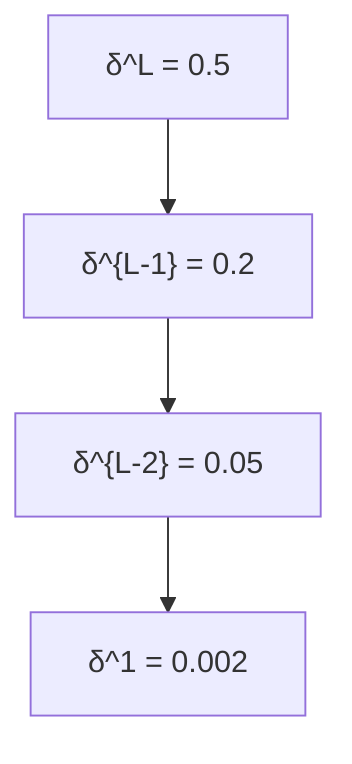

[[Learning is slow for sigmoid]]

>[!info] Vanishing gradients occur because of **repeated multiplication of small derivatives** (via the chain rule)

In backpropagation, gradients are passed backward from output to input.
Then gradients **shrink layer by layer**, especially in deep networks → early layers learn **very slowly or not at all**.

Gradient Magnitude
 │.          *    *   *.   *
│     *
│    * 
│   *  
│  *   
│ *    
│*     
└───────────▶ Layer Depth (Output ➝ Input)
     L   L-1   L-2  ... 1
 _how the **magnitude of gradients** (or delta values $\delta^l$) **decrease as we go backward through the layers**_

- **Steep decay** = gradients are vanishing.
- This is typical with **sigmoid/tanh** activations.
### **Node-by-Node Shrink (Traces how  δ values (errors) shrink over layers.)**

## **🧠 Step-by-Step Reasoning**
The main culprits:
1. **Activation derivatives** like $$ \sigma’(z) \ll 1 $$ for sigmoid/tanh
2. **Weight matrices** that shrink the gradient further
3. **Depth** (many such small multiplications)
### **🔁 In Backpropagation:**
We compute gradients layer by layer **from output to input** using the equation:
$$

\delta^l = \left( W^{l+1} \right)^T \delta^{l+1} \odot \sigma’(z^l)

$$
That is:
Gradient at layer **l** depends on:
    - **Error from layer l+1**
    - **Derivative of activation at layer l**
### **⚠️ Where Vanishing Happens**
If we use **sigmoid** or **tanh** as activation:
    - Their derivative is very small for large or small inputs.
    - Specifically:
$$ \sigma’(z) = \sigma(z)(1 - \sigma(z)) $$
        - Max at 0.25, quickly drops to ~0 as $|z|$ increases.

2. Chain rule multiplies **many small numbers**:
$$\delta^1 = \left( W^2^\top \cdot W^3^\top \cdot \dots \cdot W^L^\top \right) \cdot \delta^L \cdot \prod_{l=2}^{L} \sigma'(z^l)$$

    If each $$ \sigma’(z^l) \approx 0.1 $$ and there are 10 layers:
$$ \prod \sigma’(z^l) \approx (0.1)^{10} = 1e^{-10} $$ → **almost zero**

3. So, the **gradient becomes vanishingly small** for early layers (e.g., $$ \delta^1, \delta^2 $$)
    - These layers **stop learning**
    - Called **vanishing gradient**

> The deeper the model, the more **important it is to optimize gradient flow** — modern deep nets (ResNet, Transformers) all explicitly **design for stable gradients**.
#### **Why is learning so slow?**
To understand the origin of the problem, consider that our neuron learns by changing the weight and bias at a rate determined by the partial derivatives of the cost function, ∂C/∂w and ∂C/∂b. So saying "learning is slow" is really the same as saying that those partial derivatives are small. The challenge is to understand why they are small.

When we look closely, we'll discover that the different layers in our deep network are learning at vastly different speeds. In particular, when later layers in the network are learning well, early layers often get stuck during training, learning almost nothing at all.

### Why later neuron layers learn faster compared to earlier layers, how and why this happens

**Later layers learn faster because they receive a much stronger, cleaner teaching signal (gradient) than earlier layers.**

As the loss is backpropagated through many layers, the signal is repeatedly multiplied by Jacobians and activation derivatives. Those products usually shrink, so by the time the signal reaches the first layers it’s tiny → tiny updates → “stuck” early layers. Meanwhile, layers near the loss get large, well-conditioned gradients and move quickly.

### **Why do early layers learn more slowly than later layers?**

This is the **vanishing gradient problem** :
- In backpropagation, error $\delta$ is propagated backwards using multiplications with derivatives of activation functions.
- If those derivatives are < 1 (e.g., sigmoid’s max slope is 0.25), the signal **shrinks** layer by layer as you go backward.
- By the time it reaches the early layers, the gradient may be almost zero.

👉 Later layers (closer to the output) get “fresher” error signals → **strong gradients, faster learning**.
👉 Earlier layers (closer to input) get “diluted” error signals → **weak gradients, slower learning**.

Imagine a classroom:
- The **teacher (output layer)** gives direct feedback on mistakes. Students sitting **near the teacher (later layers)** get clear feedback, adjust quickly.
- Students sitting **far in the back (earlier layers)** hear muffled, weak instructions. They learn, but much more slowly.

---
## **🔧 Solutions to Vanishing Gradient**

How to address the vanishing gradient problem.

|**Fix**|**Why It Works**|
|---|---|
|**ReLU** activation|Derivative is 1 when active (no squashing)|
|**BatchNorm**|Keeps activations in a good range|
|**Residual Connections**|Helps preserve gradient flow|
|**LayerNorm**|Stabilizes deeper networks|
|**Better initialization**|(e.g., He/Xavier) avoids early saturation|

> If you were designing a new architecture, how would you detect vanishing gradients **before** training completes?

### 1. **📉** **Track Gradient Magnitudes During Initialization**
Before/after the first batch:
- **Log**: $$ \text{mean}(|\nabla W|) $$ or $$ |\nabla W|_2 $$**Across layers**: Plot per-layer gradient norms
#### **🔍 If you see:**
- Later layers: ~0.1
- Early layers: ~1e-6 or lower
🔥 Red flag: vanishing gradients

### 2. **📊** **Histogram of Gradient Distribution**
- Log histogram of gradients **per layer**
- Use tools like **TensorBoard**, **Weights & Biases**, or **Matplotlib**
#### **📉 What to look for:**
- Narrow peaks near **0**
- Sharp skewed distributions (only negative or positive)

> If you detect vanishing gradients in your model, how would you redesign it?