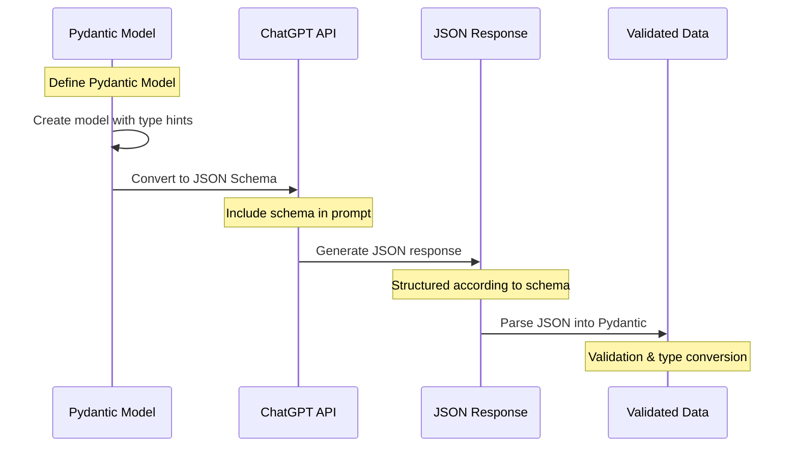
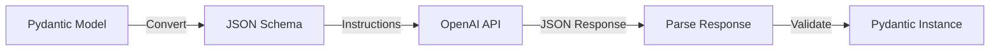
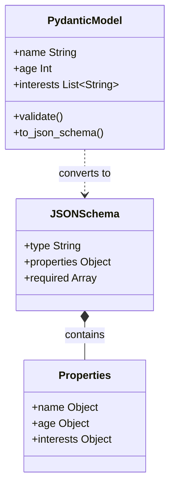
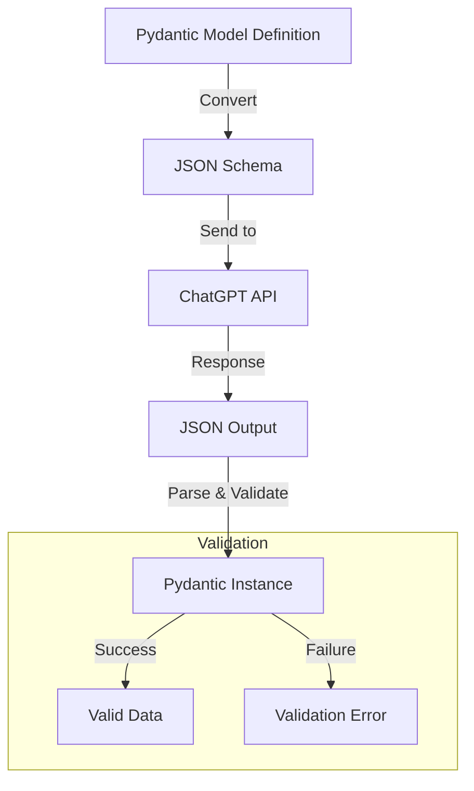

## The key differences between Pydantic and JSON Schema are:
- Pydantic provides Python-native type checking and validation
- JSON Schema is the language-agnostic representation used by APIs
- The conversion between them is handled automatically
- Validation happens when parsing the JSON response back into Pydantic



## Why convert Pydantic Model into Json schema?
Because OpenAI’s API  does not natively understand or parse Pydantic model definitions, you need to convert your Pydantic model into a JSON Schema so that you can instruct the model in a format it recognizes. The JSON Schema tells the AI explicitly what structure and data types you expect the response to have.
- Defining your expected structure
- Validating the response
- Type safety in your Python code
- The conversion to JSON Schema is needed to instruct the model about the expected format



### Clear Instructions for the Model = Better Responses
Providing a JSON Schema to ChatGPT serves as a _declarative_ contract:

> _“Here’s exactly the structure and data types I need back.”_

This prevents ambiguity and ensures ChatGPT’s response matches your model requirements. Merely describing a Pydantic class in Python does not offer the same level of clarity—ChatGPT might misunderstand your code snippet or ignore it. A JSON Schema is explicit.


### Pydantic vs JSON Schema Comparison



Data Flow and Validation Process




## Round-Trip Validation with Pydantic
Once ChatGPT returns a JSON response that _claims_ to follow your schema, you can parse and validate that JSON against the original Pydantic model. This is a robust round-trip:
1. **Pydantic Model** → convert to → **JSON Schema**
2. **JSON Schema** → used to instruct → **ChatGPT**
3. **JSON output** from ChatGPT → parsed & validated → **Pydantic Model Instance**
This flow ensures type safety and validates the data at both ends.

Example showing conversion and validation process.
```schema_conversion_val.py
from pydantic import BaseModel
from typing import List
import json

# 1. Pydantic Model
class UserProfile(BaseModel):
    name: str
    age: int
    interests: List[str]

# 2. Convert to JSON Schema
schema = UserProfile.model_json_schema()
print("JSON Schema:")
print(json.dumps(schema, indent=2))

# 3. Example ChatGPT Response
gpt_response = {
    "name": "John Doe",
    "age": 30,
    "interests": ["coding", "reading"]
}

# 4. Validate and Create Instance
try:
    user = UserProfile(**gpt_response)
    print("\nValidated User Object:")
    print(user.model_dump())
except ValueError as e:
    print(f"Validation Error: {e}")
```

## Conclusion
- **OpenAI’s API only understands textual instructions and JSON schemas**—it does not directly support Python or Pydantic structures.
- **Converting your Pydantic model to JSON Schema** is the best practice to ensure ChatGPT produces output in the exact format you desire.
- After receiving the response, you can re-validate it with your original Pydantic model to maintain full type safety and correctness within your Python code.