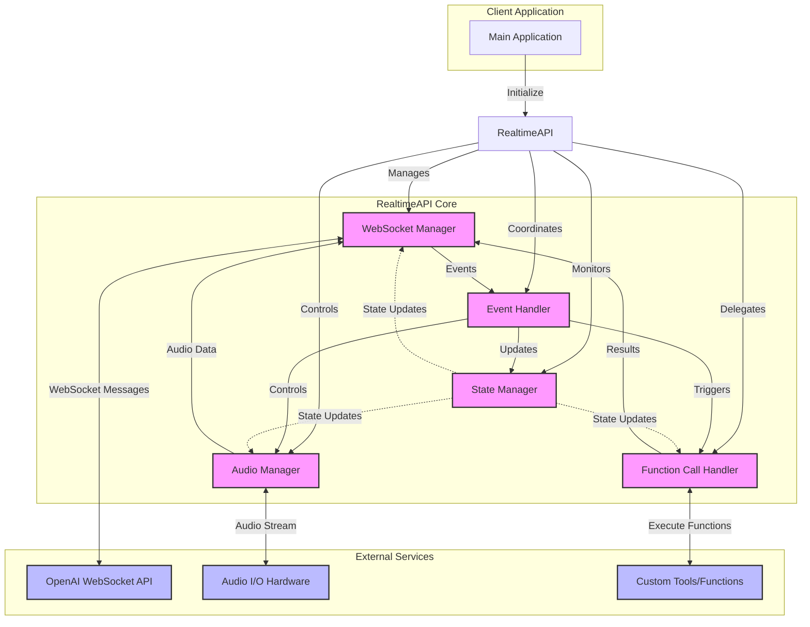

**Key Data Flows:**

Audio Flow:
- Microphone → Audio Manager → WebSocket Manager → OpenAI
- OpenAI → WebSocket Manager → Audio Manager → Speakers

Event Flow:
- OpenAI → WebSocket Manager → Event Handler → Appropriate Component

Function Call Flow:
- OpenAI → WebSocket Manager → Event Handler → Function Call Handler → Custom Tools
- Custom Tools → Function Call Handler → WebSocket Manager → OpenAI

State Management:
- All components update and read from State Manager
- State Manager ensures consistency across components

### Basics of web socket for Python

How web socket is used for audio in Python?